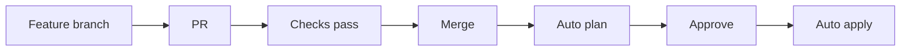

# AWS Organization Governance


## Overview

Infrastructure as Code (IaC) repository for managing AWS Organizations,
Organizational Units (OUs), Service Control Policies (SCPs), and governance
controls across multiple AWS accounts.

## Prerequisites

- [tfenv](https://github.com/tfutils/tfenv) — Terraform version manager
- [AWS CLI](https://aws.amazon.com/cli/) configured with management
  account credentials
- Python 3.x (for pre-commit hooks)
- [shellcheck](https://github.com/koalaman/shellcheck),
  [shellharden](https://github.com/anordal/shellharden),
  [gitleaks](https://github.com/gitleaks/gitleaks),
  [zizmor](https://github.com/woodruffw/zizmor) (for local hooks)
- Git

## Local Development Setup

### 1. Install Terraform via tfenv

```bash
brew install tfenv
tfenv install 1.14.5
tfenv use 1.14.5
terraform version
```

### 2. Setup Pre-commit Hooks

```bash
python3 -m venv .venv
source .venv/bin/activate
pip install pre-commit
pre-commit install
pre-commit install --hook-type commit-msg
pre-commit run --all-files
```

**Pre-commit checks (26 hooks):**

- **Formatting:** trailing-whitespace, end-of-file-fixer,
  terraform\_fmt, markdownlint
- **Validation:** check-yaml, check-json,
  check-merge-conflict, terraform\_validate
- **Security:** detect-secrets, detect-private-key, gitleaks
- **Terraform:** terraform\_tflint, terrascan
- **Shell:** shellcheck, shellharden
- **Hygiene:** check-executables-have-shebangs,
  check-shebang-scripts-are-executable,
  check-symlinks, check-case-conflict
- **Workflow:** actionlint, no-commit-to-branch
- **Commits:** conventional-pre-commit

### 3. Configure AWS Credentials

```bash
aws configure
aws sts get-caller-identity
```

## Repository Structure

```text
.
├── .github/
│   ├── actions/
│   │   ├── terraform-composite/           # Plan/apply/destroy
│   │   ├── drift-detection-composite/     # Scheduled drift checks
│   │   ├── post-deploy-validation-composite/  # Post-apply AWS validation
│   │   ├── lint-and-security-composite/   # PR lint + security scans
│   │   └── update-pre-commit-composite/   # Weekly hook autoupdate
│   ├── scripts/
│   │   ├── terraform-plan.sh              # Plan with markdown summary
│   │   ├── drift-plan.sh                  # Drift detection plan
│   │   ├── drift-check.sh                 # Evaluate drift exit code
│   │   ├── drift-issue.sh                 # Create GitHub issue on drift
│   │   ├── get-terraform-outputs.sh       # Read Terraform outputs
│   │   ├── validate-deployment.sh         # Post-apply validation
│   │   └── validate-destroy.sh            # Post-destroy validation
│   ├── workflows/
│   │   ├── terraform-cicd.yml             # Main CI/CD pipeline
│   │   ├── terraform-pr.yml              # PR checks (lint + security + plan)
│   │   ├── drift-detection.yml           # Daily drift detection
│   │   └── update-pre-commit-hooks.yml   # Weekly pre-commit autoupdate
│   └── dependabot.yml                    # GitHub Actions + Terraform updates
├── terraform/scps/
│   ├── backend.tf                         # S3 backend with native locking
│   ├── versions.tf                        # Terraform & provider versions
│   ├── providers.tf                       # AWS provider configuration
│   ├── variables.tf                       # Input variables
│   ├── terraform.tfvars.example           # Variable template
│   ├── main.tf                            # Data source + SCPs
│   └── outputs.tf                         # Output values
├── docs/
│   ├── adr/                               # Architecture Decision Records
│   ├── architecture.md                    # Architecture & design decisions
│   ├── github-oidc-setup.md              # OIDC authentication setup
│   ├── github-variables-setup.md         # GitHub Variables configuration
│   └── prerequisites.md                  # One-time SCP enablement
├── .claude/
│   ├── settings.json                      # Claude Code hooks configuration
│   ├── hooks/                             # Hook scripts (post-edit, protect-generated)
│   └── skills/new-scp/                    # SCP scaffolding skill
├── .coderabbit.yaml                       # CodeRabbit AI review config
├── .tflint.hcl                            # TFLint configuration
├── .pre-commit-config.yaml               # Pre-commit hook configuration
├── .secrets.baseline                      # Detect-secrets baseline
├── CLAUDE.md                              # Claude Code project instructions
├── CODEOWNERS                             # Default code ownership
├── CONTRIBUTING.md                        # Contribution guidelines
├── SECURITY.md                            # Security disclosure policy
└── README.md
```

## Infrastructure

### Service Control Policies

| SCP | Target | Purpose |
| --- | --- | --- |
| DevEnvironmentRestrictions | Dev OU | Instance type limits, block root user, protect CloudTrail, block admin policies |
| DevTaggingAndAbusePrevention | Dev OU | Required tagging, crypto-mining prevention, storage limits, data exposure protection |
| ProtectSSOTrustedAccess | Org root | Prevents disabling IAM Identity Center trusted access |
| RegionRestriction | Org root | Restricts all accounts to approved regions (us-east-1), exempts global services |

### Terraform Backend

- **Bucket:** S3 with native locking (Terraform 1.10+, no DynamoDB)
- **Encryption:** AES256
- **Versioning:** Enabled

### Terraform Versions

- Terraform: 1.14.5
- AWS Provider: ~> 6.0

## Getting Started

1. Clone and setup dev environment (see above)
2. [Enable SCPs](docs/prerequisites.md) (one-time)
3. [Setup GitHub OIDC](docs/github-oidc-setup.md)
4. [Configure GitHub Variables](docs/github-variables-setup.md)
5. Configure local tfvars:

   ```bash
   cd terraform/scps
   cp terraform.tfvars.example terraform.tfvars
   # Edit with your values
   ```

6. Initialize: `terraform init`

## Development Workflow



1. Create feature branch, make changes, commit (pre-commit hooks run)
2. Push and create PR — automated checks: lint, security scan, plan preview
3. CodeRabbit + Copilot provide AI-powered code review
4. Merge to main — plan runs automatically, apply job pauses at environment gate
5. Click "Review deployments" → Approve → apply runs using the same plan (no re-run)

## CI/CD Pipeline

### Workflows

| Workflow | Trigger | Purpose |
| --- | --- | --- |
| `terraform-cicd.yml` | Push to main, manual | Plan → environment approval → apply (artifact reuse), manual destroy |
| `terraform-pr.yml` | PR | Lint (fmt, tflint), security (checkov), plan |
| `quality-checks.yml` | PR, push to main | Markdownlint, shellcheck, yamllint, zizmor, structure validation (step summaries) |
| `security.yml` | PR, push to main | Semgrep SAST, Trivy IaC scanning (step summaries) |
| `drift-detection.yml` | Daily 9 AM UTC | Detects config drift, creates GitHub issue |
| `update-pre-commit-hooks.yml` | Weekly Sunday | Auto-updates hook versions, creates PR |

### Authentication

OIDC — no long-lived credentials. Temporary tokens via AWS STS.

- **Role:** `GitHubActions-OrganizationGovernance`
- **Inline policies:** `SCPManagement` (scoped org access with explicit deny
  on dangerous actions) + `TerraformStateAccess` (S3 bucket)

See [GitHub OIDC Setup Guide](docs/github-oidc-setup.md).

### Defense in Depth

| Layer | Mechanism |
| --- | --- |
| Pre-commit (local) | 26 hooks — formatting, validation, security, linting |
| PR checks (CI) | TFLint, Checkov, plan, quality checks, security scanning, CodeRabbit + Copilot AI review |
| Branch protection | PR required, status checks must pass, no direct pushes |
| Deployment gate | `production` environment with required reviewer approval |
| Post-deploy validation | AWS CLI checks — SCPs exist, attached correctly, content verified |
| AI deployment analysis | Claude via Bedrock — security posture, SCP conflicts, recommendations |
| Post-destroy validation | AWS CLI checks — SCPs removed, no orphaned policies |
| Drift detection | Daily scheduled plan, auto-creates issue on drift |
| Automated updates | Dependabot + pre-commit autoupdate |

## Architecture Diagrams

| Diagram | Description |
| --- | --- |
| [SCP Architecture](docs/aws-org-governance-architecture.png) | Organization hierarchy, SCP attachments, OIDC auth flow |
| [CI/CD Pipeline](docs/cicd-pipeline-flow.png) | PR checks, environment gate, apply/destroy/drift flows |
| [Defense in Depth](docs/defense-in-depth.png) | 6 security layers from local hooks to continuous monitoring |

See [Architecture](docs/architecture.md) for full details.

## Quick Links

- [Architecture](docs/architecture.md)
- [Architecture Decision Records](docs/adr/)
- [GitHub OIDC Setup](docs/github-oidc-setup.md)
- [GitHub Variables Setup](docs/github-variables-setup.md)
- [Prerequisites](docs/prerequisites.md)
- [GitHub Actions](https://github.com/gamaware/aws-organization-governance/actions)

## License

MIT License — see LICENSE file for details.

## Author

Created by [Alex Garcia](https://github.com/gamaware)

- [LinkedIn](https://www.linkedin.com/in/gamaware/)
- [Website](https://alexgarcia.info/)

> **Disclaimer**: All views and opinions expressed in this repository
> are my own and do not represent the opinions of my employer.
