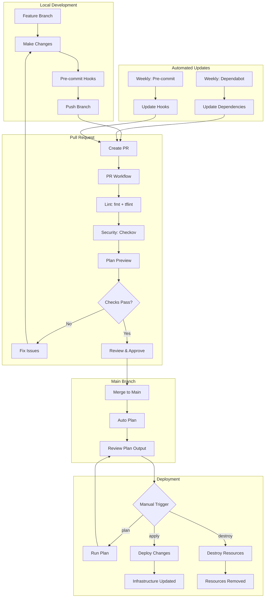

# AWS Organization Architecture

## Organization Structure

```text
Organization (o-3ffm2cc86k)
├─ Management Account: General (557690606827)
│  └─ Alias: alex-garcia-general
│
└─ Root
   ├─ OU: Dev (ou-srmc-f52jl8so)
   │  └─ Dev Account (311141527383)
   │     └─ Alias: alex-garcia-dev
   │
   ├─ OU: DevOps (ou-srmc-yio2u8xw)
   │  └─ DevOps Account (626635444569)
   │     └─ Alias: alex-garcia-devops
   │
   ├─ OU: Prod (ou-srmc-ht4bzwfc)
   │  └─ Prod Account (571600856221)
   │     └─ Alias: alex-garcia-prod
   │
   └─ OU: QA (ou-srmc-3swc55qp)
      └─ QA Account (222634394903)
         └─ Alias: alex-garcia-qa
```

## Service Control Policies (SCPs)

### Dev OU SCP

Applied to: Dev OU (ou-srmc-f52jl8so)

**Guardrails:**

- Restrict to us-east-1 region only
- Allow only cost-effective EC2 instances (t2, t3, t3a, t4g
  families)
- Allow only cost-effective RDS instances (db.t2, db.t3, db.t4g
  families)
- Prevent leaving organization
- Block root user actions
- Prevent CloudTrail deletion/modification
- Block Reserved Instance purchases

**Purpose:** Enable developers to experiment and build while
maintaining cost controls and security guardrails.

## IAM Strategy

### Dev Account

**Group:** Developers
**Policy:** PowerUserAccess + Limited IAM permissions
**Members:** 7 developers

**Permissions:**

- Full access to AWS services (Lambda, S3, EC2, RDS, etc.)
- Can create IAM roles for applications
- Can pass roles to services
- Cannot modify users, groups, or their own permissions

**Guardrails (via SCP):**

- Even with PowerUser access, cannot violate SCP restrictions
- Cannot launch expensive resources
- Cannot use regions outside us-east-1
- Cannot disable audit logging

## Deployment Strategy

### Infrastructure as Code

- **Tool:** Terraform 1.14.5
- **Provider:** AWS ~> 6.0 (latest: 6.33.0)
- **Backend:** S3 with native locking (no DynamoDB)
- **Version Control:** GitHub
- **CI/CD:** GitHub Actions

### Terraform Backend Configuration

```hcl
terraform {
  backend "s3" {
    bucket       = "terraform-state-aws-org-governance-557690606827"
    key          = "scps/terraform.tfstate"
    region       = "us-east-1"
    encrypt      = true
    use_lockfile = true  # S3 native locking (Terraform 1.14+)
  }
}
```

**Why S3 native locking?**

- No DynamoDB table required (simpler infrastructure)
- Built-in to Terraform 1.14+
- Automatic cleanup of stale locks
- Lower cost (no DynamoDB charges)

### CI/CD Workflow



**Development Flow:**

1. **Local:** Create feature branch, make changes, pre-commit hooks validate
2. **PR:** Push branch, create PR, automated checks run (lint, security, plan)
3. **Review:** Approve PR after checks pass
4. **Merge:** Merge to main, plan runs automatically
5. **Deploy:** Review plan, manually trigger apply via workflow_dispatch

**Deployment Options:**

- **plan:** Generate and review execution plan
- **apply:** Deploy infrastructure changes
- **destroy:** Remove managed resources

**Automated Maintenance:**

- **Dependabot:** Weekly updates for GitHub Actions and Terraform providers
- **Pre-commit Autoupdate:** Weekly updates for hook versions

## Security Controls

### Defense in Depth Layers

#### 1. Pre-commit Hooks (Local)

- Terraform fmt & validate
- Secret detection (detect-secrets)
- Private key detection
- YAML validation
- Markdown linting (markdownlint)
- GitHub Actions validation (actionlint)
- Blocks commits with issues

#### 2. GitHub Actions (CI)

**PR Workflow (`terraform-pr.yml`):**

- TFLint (Terraform best practices)
- Checkov (security & compliance)
- Terraform plan preview
- Runs on every PR

**CI/CD Workflow (`terraform-cicd.yml`):**

- Unified workflow for plan/apply/destroy
- Auto-runs plan on push to main
- Manual trigger with action dropdown
- Artifact sharing between jobs
- Plan summary in GitHub UI
- Color output enabled

#### 3. Branch Protection

- Requires PR approval
- Status checks must pass
- No direct commits to main
- No force pushes

#### 4. Manual Deployment Gate

- Human review required
- Explicit workflow trigger via workflow_dispatch
- Three actions: plan, apply, destroy
- Plan review before apply

#### 5. Automated Updates

**Dependabot (`dependabot.yml`):**

- Weekly updates for GitHub Actions
- Weekly updates for Terraform providers
- Auto-creates PRs

**Pre-commit Autoupdate (`update-pre-commit-hooks.yml`):**

- Weekly updates for pre-commit hooks
- Auto-creates PRs with updated versions

### Authentication

**GitHub Actions OIDC:**

- No long-lived credentials stored
- Temporary tokens via AWS STS
- Repository-scoped trust policy
- Role: `GitHubActions-OrganizationGovernance`
- Permissions: AWSOrganizationsFullAccess + S3 state access

See [GitHub OIDC Setup Guide](github-oidc-setup.md) for configuration details.

### Preventive Controls (SCPs)

- Region restrictions
- Instance type restrictions
- Root user blocking
- Organization protection
- CloudTrail protection

### Detective Controls

- CloudTrail (cannot be disabled via SCP)
- AWS Config (recommended)
- Security Hub (recommended)
- GitHub Actions audit logs

### Compliance

- All infrastructure changes tracked in Git
- All deployments require approval
- Security scanning on every change
- Immutable state history (S3 versioning)
- Weekly dependency updates
