# AWS Organization Architecture

## Architecture Diagrams

### SCP Architecture

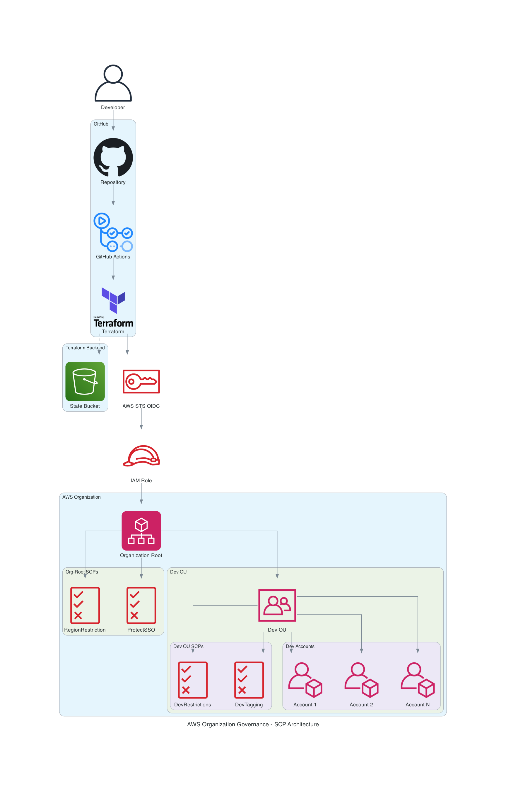

### CI/CD Pipeline Flow

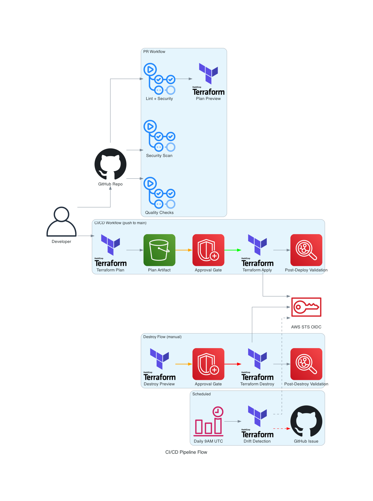

### Defense in Depth Layers

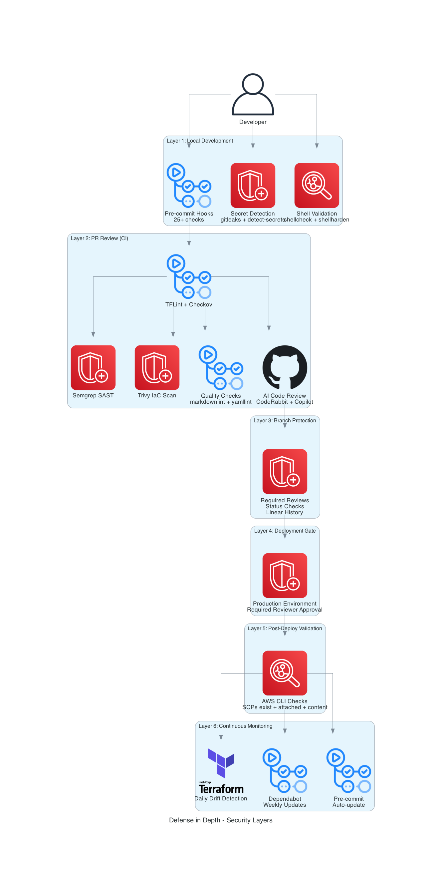

## Organization Structure

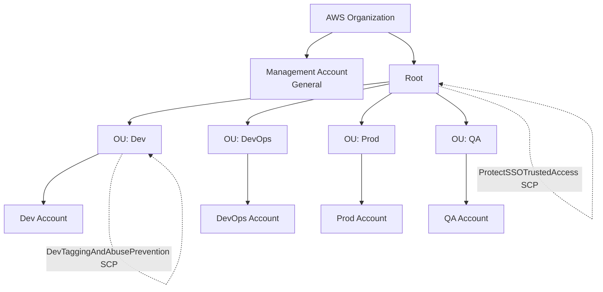

## Service Control Policies (SCPs)

### DevEnvironmentRestrictions

Applied to: Dev OU

**Guardrails:**

- Allow only cost-effective EC2 instances (t2, t3, t3a, t4g families)
- Allow only cost-effective RDS instances (db.t2, db.t3, db.t4g families)
- Prevent leaving organization
- Block root user actions
- Prevent CloudTrail deletion/modification
- Block Reserved Instance purchases
- Block admin policy attachment

**Purpose:** Enable developers to experiment while maintaining cost
controls and security guardrails. Region restriction is handled by the
org-root RegionRestriction SCP to avoid conflicting with global service
exemptions.

### ProtectSSOTrustedAccess

Applied to: Organization root

**Guardrails:**

- Deny `organizations:DisableAWSServiceAccess` for
  `sso.amazonaws.com`
- Deny `organizations:DeregisterDelegatedAdministrator` for
  `sso.amazonaws.com`

**Purpose:** Prevent accidental or malicious disabling of IAM Identity
Center (SSO) trusted access, which would break SSO for all accounts.

### RegionRestriction

Applied to: Organization root

**Guardrails:**

- Deny all actions outside `us-east-1` for all accounts
- Exempt truly global services via `NotAction`: IAM, STS, Organizations,
  Route 53, CloudFront, Shield, Global Accelerator, WAF Classic (global scope),
  Billing, Cost Explorer, Budgets, Support, Health, Trusted Advisor,
  Tag Editor, Marketplace, and S3 bucket listing
- Regional services (ACM, KMS, WAFv2, etc.) are NOT exempted — they operate
  within the allowed region only

**Purpose:** Organization-wide region restriction that prevents any account
from deploying resources in unapproved regions. Uses the `NotAction` pattern
to exempt only services with global endpoints, ensuring regional services
like KMS and ACM can only operate within allowed regions.

## IAM Strategy

### GitHub Actions Role

**Role:** `GitHubActions-OrganizationGovernance`

**Authentication:** OIDC (no long-lived credentials)

**Inline policies:**

- `SCPManagement` — scoped Organizations access (create, update, delete,
  attach, detach SCPs + describe/list + tag operations) with explicit deny
  on dangerous actions (DisableAWSServiceAccess, DeleteOrganization, etc.)
- `TerraformStateAccess` — S3 bucket read/write for Terraform state
- `BedrockModelAccess` — Claude Sonnet 4.6 invocation for AI post-deploy
  analysis (cross-region inference profiles require all-region wildcard)

### Dev Account

**Group:** Developers
**Policy:** PowerUserAccess + Limited IAM permissions

**Permissions:**

- Full access to AWS services (Lambda, S3, EC2, RDS, etc.)
- Can create IAM roles for applications
- Cannot modify users, groups, or their own permissions

**Guardrails (via SCP):**

- Cannot violate SCP restrictions even with PowerUser access
- Cannot launch expensive resources
- Cannot use regions outside us-east-1
- Cannot disable audit logging

## Deployment Strategy

### Infrastructure as Code

- **Tool:** Terraform 1.14.5
- **Provider:** AWS ~> 6.0
- **Backend:** S3 with native locking (no DynamoDB)
- **Linting:** TFLint with terraform + AWS rulesets (preset=all)
- **Security:** Checkov, terrascan, detect-secrets, gitleaks
- **CI/CD:** GitHub Actions with composite actions
- **Code Review:** CodeRabbit AI + GitHub Copilot

### CI/CD Workflow

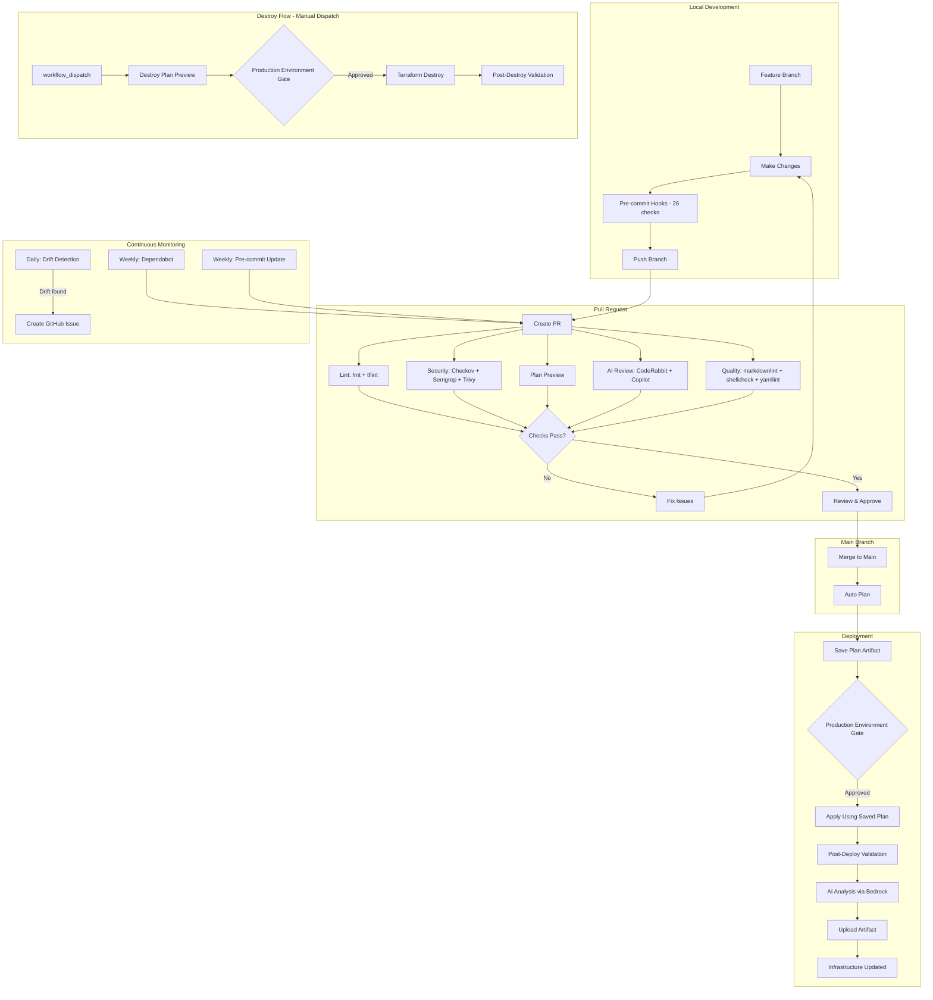

### Terraform Backend Configuration

```hcl
terraform {
  backend "s3" {
    bucket       = "<BUCKET_NAME>"
    key          = "scps/terraform.tfstate"
    region       = "us-east-1"
    encrypt      = true
    use_lockfile = true
  }
}
```

**Why S3 native locking?**

- No DynamoDB table required (simpler infrastructure)
- Built-in to Terraform 1.10+
- Automatic cleanup of stale locks
- Lower cost

## SCP Union-Deny Model

SCPs use a union-deny evaluation: if **any** SCP in the hierarchy denies
an action, it is blocked regardless of what other policies allow. This has
critical implications for how org-root and OU-level SCPs interact.

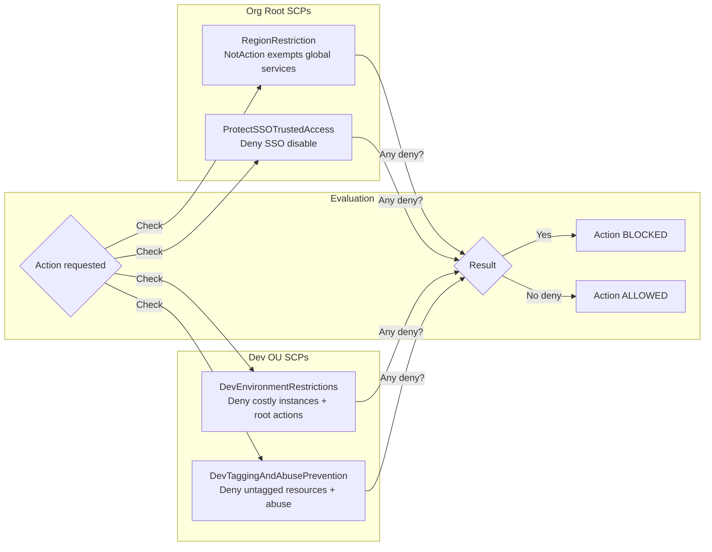

**Key rules:**

- Never use blanket `Action: *` deny alongside a `NotAction` pattern — the
  blanket deny fires on the exempted global services
- Org-root SCPs apply to ALL accounts in the hierarchy including Dev OU
- OU-level SCPs add additional restrictions, they cannot relax org-root denies
- Condition keys that are absent from a request cause `StringNotLike` to
  evaluate as true (deny fires) — always pair with a `Null` check

## AI Post-Deployment Analysis

After every terraform apply, an AI analysis runs via Claude Sonnet 4.6 on
Amazon Bedrock. It reviews all SCP policies, the terraform plan, and
deterministic validation results.

### Analysis Flow

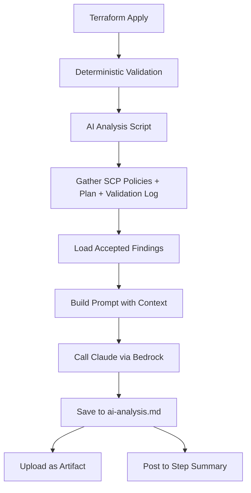

### Accepted Findings Loop

The AI prompt includes `terraform/scps/accepted-findings.md` which tracks
all previously triaged findings. This prevents the non-deterministic nature
of AI from re-reporting the same issues on every run.

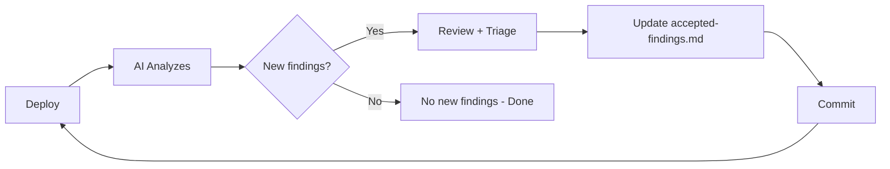

**Dispositions:** Each finding gets one of four statuses:

| Status | Meaning |
| --- | --- |
| fixed | Resolved in code |
| accepted-risk | Reviewed, intentionally left as-is |
| wont-fix | Not worth the complexity or out of scope |
| to-fix | Real issue, scheduled for a future PR |

**Regression detection:** If a finding marked as "fixed" reappears, the AI
flags it as a regression instead of suppressing it.

**Access:** Download the artifact via `gh run download <RUN_ID> -n ai-deployment-analysis`
then read `ai-analysis.md`.

### Bedrock IAM

The GitHub Actions role has a `BedrockModelAccess` inline policy:

- Foundation models: `arn:aws:bedrock:*::foundation-model/anthropic.*`
- Inference profiles: `arn:aws:bedrock:*:*:inference-profile/us.anthropic.*`

All-region wildcards are required because cross-region inference profiles
(`us.anthropic.claude-sonnet-4-6`) route requests internally across
multiple US regions.

## Resource Cleanup

Automated resource cleanup for sandbox and development accounts using a
Step Functions orchestration pipeline. Removes unused or abandoned resources
to control costs and maintain a clean environment.

### Cleanup Architecture

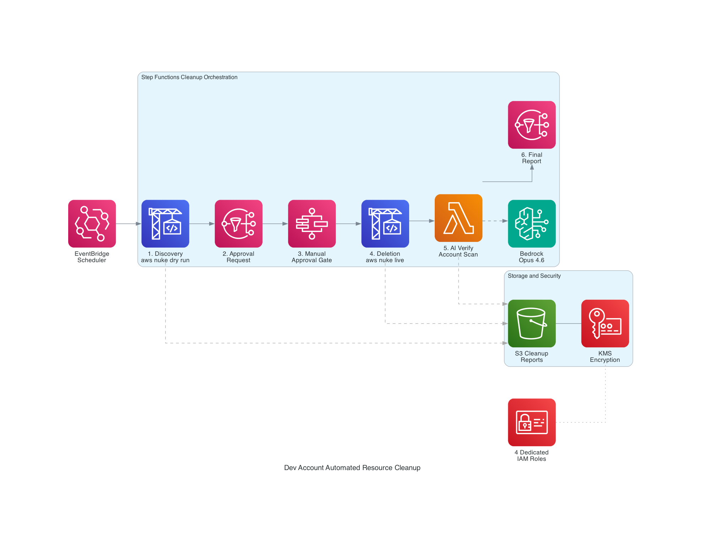

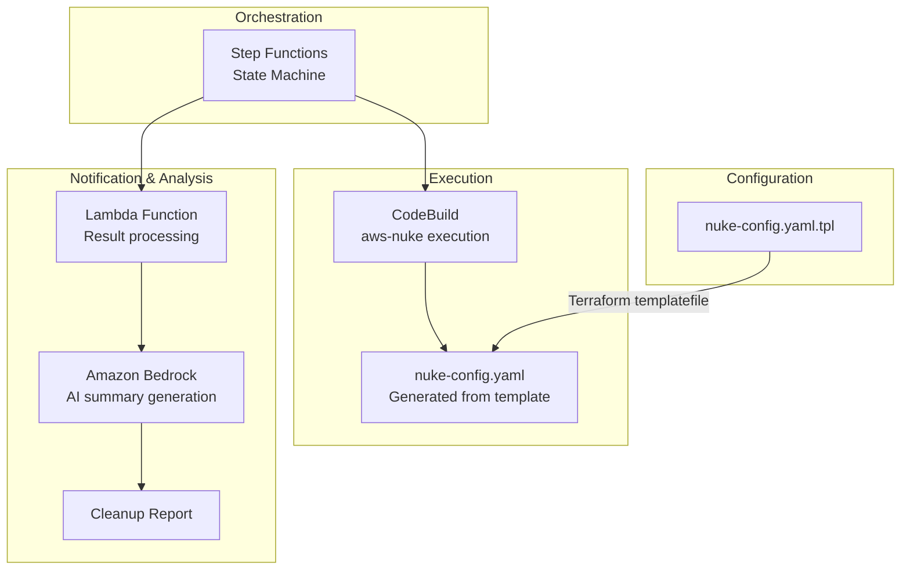

### Components

- **Step Functions** — Orchestrates the cleanup workflow end-to-end, coordinating
  CodeBuild execution, Lambda processing, and error handling with retries
- **CodeBuild** — Runs aws-nuke against target accounts using the generated
  nuke configuration, providing isolated execution with proper IAM credentials
- **Lambda** — Processes cleanup results, formats output, and triggers AI analysis
  via Bedrock for human-readable cleanup summaries
- **Bedrock** — Generates AI-powered summaries of cleanup actions, highlighting
  what was removed, what was preserved, and any anomalies detected
- **nuke-config.yaml.tpl** — Terraform template that generates account-specific
  aws-nuke configuration with resource filters and exclusion rules

### Cleanup IAM Roles

Cleanup IAM roles follow least-privilege principles defined in `terraform/cleanup/iam.tf`:

- CodeBuild role scoped to target account actions only
- Lambda role limited to Bedrock invocation and Step Functions callbacks
- Step Functions role restricted to invoking the specific CodeBuild project and Lambda function

### CI/CD

The cleanup module has its own pipeline (`cleanup-cicd.yml`) separate from the
main SCP workflow, preventing cleanup infrastructure changes from affecting
organization policy deployments.

### Testing

The `cleanup-test-infra.sh` script validates cleanup infrastructure by verifying
IAM roles, Step Functions state machine configuration, and Lambda function
deployment before running cleanup operations.

## End-to-End Deployment Lifecycle

Complete flow from code change to live SCP, showing what happens at each
stage and which component is responsible.

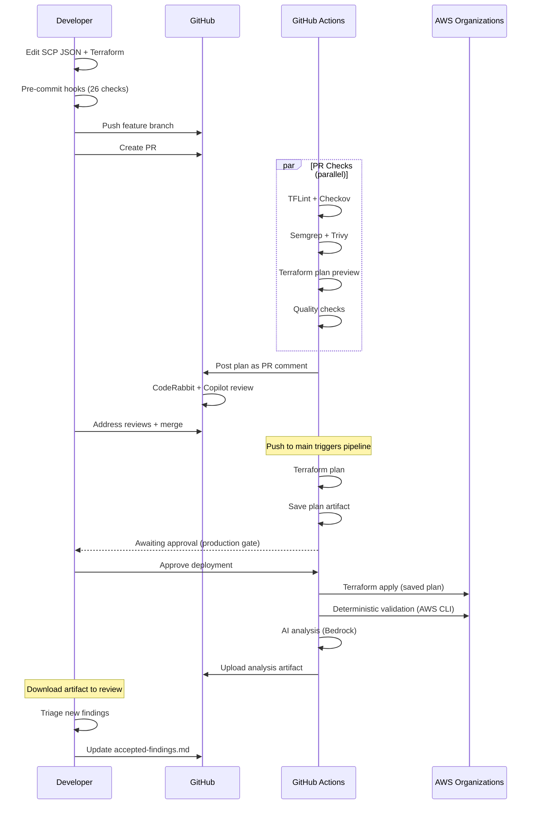

## Security Controls

### Defense in Depth

#### 1. Pre-commit Hooks (Local — 26 hooks)

- Terraform fmt, validate, tflint, terrascan
- Secret detection: detect-secrets, detect-private-key, gitleaks
- Shell linting: shellcheck, shellharden
- Hygiene: YAML/JSON validation, merge conflict detection, symlink checks
- Workflow: actionlint, no-commit-to-branch, conventional commits

#### 2. PR Checks (CI)

- Lint and security: terraform fmt, tflint, checkov
- Quality checks: markdownlint, shellcheck, yamllint, zizmor
- Security scanning: Semgrep SAST, Trivy IaC
- Terraform plan preview
- AI code review: CodeRabbit + GitHub Copilot

#### 3. Branch Protection

- Requires PR approval (CODEOWNERS enforced)
- Required status checks (strict — branch must be up to date)
- Required conversation resolution
- Required linear history
- No direct commits to main

#### 4. Deployment Gate

- `production` environment with required reviewer approval
- Plan artifact saved and reused for apply (no re-plan)
- Destroy requires manual `workflow_dispatch` plus environment approval

#### 5. Post-Deployment Validation

- Deterministic: AWS CLI verification after apply — SCPs exist, attached
  to correct targets, policy content matches expectations
- AI analysis: Claude via Bedrock reviews security posture, SCP conflicts,
  best practices, and recommendations (artifact uploaded for review)
- AWS CLI verification after destroy: no orphaned SCPs remain

#### 6. Drift Detection

- Daily scheduled Terraform plan
- Auto-creates GitHub issue if drift detected

#### 7. Automated Updates

- Dependabot: weekly updates for GitHub Actions + Terraform providers
- Pre-commit autoupdate: weekly hook version updates
- Both auto-create PRs for review

### Preventive Controls (SCPs)

- Region restrictions
- Instance type restrictions
- Root user blocking
- Organization protection
- CloudTrail protection
- SSO trusted access protection

### Detective Controls

- CloudTrail (cannot be disabled via SCP)
- Drift detection (daily)
- AWS Config (recommended)
- Security Hub (recommended)

### Compliance

- All infrastructure changes tracked in Git
- All deployments require approval
- Security scanning on every change
- Immutable state history (S3 versioning)
- Weekly dependency updates
- AI-assisted code review on every PR
