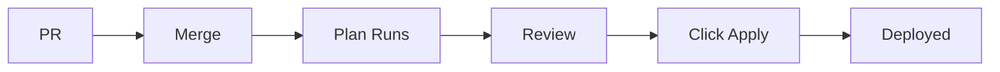

# AWS Organization Architecture

## Organization Structure

```
Organization (o-3ffm2cc86k)
├─ Management Account: General (557690606827)
│  └─ Alias: alex-garcia-general
│
└─ Root
   ├─ OU: Dev (ou-srmc-f52jl8so)
   │  └─ Dev Account (311141527383)
   │     └─ Alias: alex-garcia-dev
   │
   ├─ OU: DevOps (ou-srmc-yio2u8xw)
   │  └─ DevOps Account (626635444569)
   │     └─ Alias: alex-garcia-devops
   │
   ├─ OU: Prod (ou-srmc-ht4bzwfc)
   │  └─ Prod Account (571600856221)
   │     └─ Alias: alex-garcia-prod
   │
   └─ OU: QA (ou-srmc-3swc55qp)
      └─ QA Account (222634394903)
         └─ Alias: alex-garcia-qa
```

## Service Control Policies (SCPs)

### Dev OU SCP

Applied to: Dev OU (ou-srmc-f52jl8so)

**Guardrails:**
- Restrict to us-east-1 region only
- Allow only cost-effective EC2 instances (t2, t3, t3a, t4g families)
- Allow only cost-effective RDS instances (db.t2, db.t3, db.t4g families)
- Prevent leaving organization
- Block root user actions
- Prevent CloudTrail deletion/modification
- Block Reserved Instance purchases

**Purpose:** Enable developers to experiment and build while maintaining cost controls and security guardrails.

## IAM Strategy

### Dev Account

**Group:** Developers
**Policy:** PowerUserAccess + Limited IAM permissions
**Members:** 7 developers

**Permissions:**
- Full access to AWS services (Lambda, S3, EC2, RDS, etc.)
- Can create IAM roles for applications
- Can pass roles to services
- Cannot modify users, groups, or their own permissions

**Guardrails (via SCP):**
- Even with PowerUser access, cannot violate SCP restrictions
- Cannot launch expensive resources
- Cannot use regions outside us-east-1
- Cannot disable audit logging

## Deployment Strategy

### Infrastructure as Code

- **Tool:** Terraform
- **Version Control:** GitHub
- **CI/CD:** GitHub Actions

### Workflow



**Steps:**
1. Create PR → Linting, security scan, plan preview
2. Merge to main → Plan runs automatically
3. Review plan output in Actions tab
4. Click "Run workflow" on Terraform Apply
5. Infrastructure deployed

### Environments

- **plan:** No approval required (preview only)
- **production:** Requires manual approval before apply

## Security Controls

### Preventive Controls (SCPs)
- Region restrictions
- Instance type restrictions
- Root user blocking
- Organization protection

### Detective Controls
- CloudTrail (cannot be disabled)
- AWS Config (recommended)
- Security Hub (recommended)

### Compliance
- All infrastructure changes tracked in Git
- All deployments require approval
- Security scanning on every change
