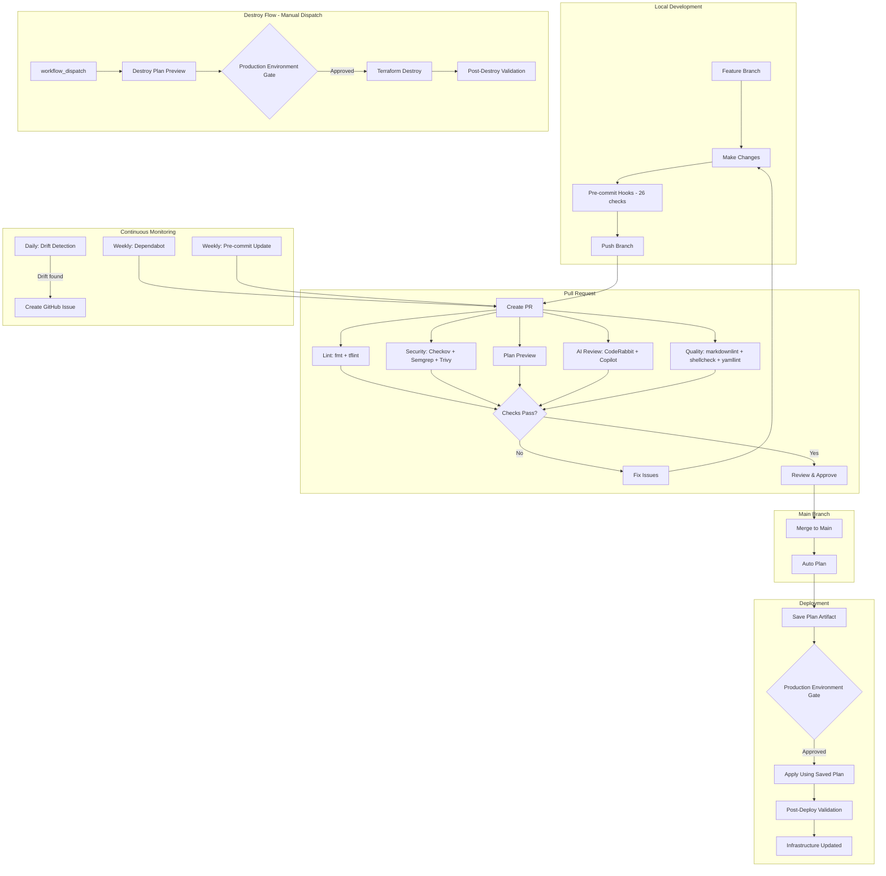

# AWS Organization Architecture

## Architecture Diagrams

### SCP Architecture


### CI/CD Pipeline Flow


### Defense in Depth Layers


## Organization Structure

```text
Organization
├─ Management Account (General)
│
└─ Root
   ├─ OU: Dev
   │  └─ Dev Account
   │
   ├─ OU: DevOps
   │  └─ DevOps Account
   │
   ├─ OU: Prod
   │  └─ Prod Account
   │
   └─ OU: QA
      └─ QA Account
```

## Service Control Policies (SCPs)

### DevEnvironmentRestrictions

Applied to: Dev OU

**Guardrails:**

- Allow only cost-effective EC2 instances (t2, t3, t3a, t4g families)
- Allow only cost-effective RDS instances (db.t2, db.t3, db.t4g families)
- Prevent leaving organization
- Block root user actions
- Prevent CloudTrail deletion/modification
- Block Reserved Instance purchases
- Block admin policy attachment

**Purpose:** Enable developers to experiment while maintaining cost
controls and security guardrails. Region restriction is handled by the
org-root RegionRestriction SCP to avoid conflicting with global service
exemptions.

### ProtectSSOTrustedAccess

Applied to: Organization root

**Guardrails:**

- Deny `organizations:DisableAWSServiceAccess` for
  `sso.amazonaws.com`
- Deny `organizations:DeregisterDelegatedAdministrator` for
  `sso.amazonaws.com`

**Purpose:** Prevent accidental or malicious disabling of IAM Identity
Center (SSO) trusted access, which would break SSO for all accounts.

### RegionRestriction

Applied to: Organization root

**Guardrails:**

- Deny all actions outside `us-east-1` for all accounts
- Exempt truly global services via `NotAction`: IAM, STS, Organizations,
  Route 53, CloudFront, Shield, Global Accelerator, WAF Classic (global scope),
  Billing, Cost Explorer, Budgets, Support, Health, Trusted Advisor,
  Tag Editor, Marketplace, and S3 bucket listing
- Regional services (ACM, KMS, WAFv2, etc.) are NOT exempted — they operate
  within the allowed region only

**Purpose:** Organization-wide region restriction that prevents any account
from deploying resources in unapproved regions. Uses the `NotAction` pattern
to exempt only services with global endpoints, ensuring regional services
like KMS and ACM can only operate within allowed regions.

## IAM Strategy

### GitHub Actions Role

**Role:** `GitHubActions-OrganizationGovernance`

**Authentication:** OIDC (no long-lived credentials)

**Inline policies:**

- `SCPManagement` — scoped Organizations access (create, update, delete,
  attach, detach SCPs + describe/list + tag operations) with explicit deny
  on dangerous actions (DisableAWSServiceAccess, DeleteOrganization, etc.)
- `TerraformStateAccess` — S3 bucket read/write for Terraform state

### Dev Account

**Group:** Developers
**Policy:** PowerUserAccess + Limited IAM permissions

**Permissions:**

- Full access to AWS services (Lambda, S3, EC2, RDS, etc.)
- Can create IAM roles for applications
- Cannot modify users, groups, or their own permissions

**Guardrails (via SCP):**

- Cannot violate SCP restrictions even with PowerUser access
- Cannot launch expensive resources
- Cannot use regions outside us-east-1
- Cannot disable audit logging

## Deployment Strategy

### Infrastructure as Code

- **Tool:** Terraform 1.14.5
- **Provider:** AWS ~> 6.0
- **Backend:** S3 with native locking (no DynamoDB)
- **Linting:** TFLint with terraform + AWS rulesets (preset=all)
- **Security:** Checkov, terrascan, detect-secrets, gitleaks
- **CI/CD:** GitHub Actions with composite actions
- **Code Review:** CodeRabbit AI + GitHub Copilot

### CI/CD Workflow



### Terraform Backend Configuration

```hcl
terraform {
  backend "s3" {
    bucket       = "<BUCKET_NAME>"
    key          = "scps/terraform.tfstate"
    region       = "us-east-1"
    encrypt      = true
    use_lockfile = true
  }
}
```

**Why S3 native locking?**

- No DynamoDB table required (simpler infrastructure)
- Built-in to Terraform 1.10+
- Automatic cleanup of stale locks
- Lower cost

## Security Controls

### Defense in Depth

#### 1. Pre-commit Hooks (Local — 26 hooks)

- Terraform fmt, validate, tflint, terrascan
- Secret detection: detect-secrets, detect-private-key, gitleaks
- Shell linting: shellcheck, shellharden
- Hygiene: YAML/JSON validation, merge conflict detection, symlink checks
- Workflow: actionlint, no-commit-to-branch, conventional commits

#### 2. PR Checks (CI)

- Lint and security: terraform fmt, tflint, checkov
- Quality checks: markdownlint, shellcheck, yamllint, zizmor
- Security scanning: Semgrep SAST, Trivy IaC
- Terraform plan preview
- AI code review: CodeRabbit + GitHub Copilot

#### 3. Branch Protection

- Requires PR approval (CODEOWNERS enforced)
- Required status checks (strict — branch must be up to date)
- Required conversation resolution
- Required linear history
- No direct commits to main

#### 4. Deployment Gate

- `production` environment with required reviewer approval
- Plan artifact saved and reused for apply (no re-plan)
- Destroy requires manual `workflow_dispatch` plus environment approval

#### 5. Post-Deployment Validation

- AWS CLI verification after apply: SCPs exist, attached to correct
  targets, policy content matches expectations
- AWS CLI verification after destroy: no orphaned SCPs remain

#### 6. Drift Detection

- Daily scheduled Terraform plan
- Auto-creates GitHub issue if drift detected

#### 7. Automated Updates

- Dependabot: weekly updates for GitHub Actions + Terraform providers
- Pre-commit autoupdate: weekly hook version updates
- Both auto-create PRs for review

### Preventive Controls (SCPs)

- Region restrictions
- Instance type restrictions
- Root user blocking
- Organization protection
- CloudTrail protection
- SSO trusted access protection

### Detective Controls

- CloudTrail (cannot be disabled via SCP)
- Drift detection (daily)
- AWS Config (recommended)
- Security Hub (recommended)

### Compliance

- All infrastructure changes tracked in Git
- All deployments require approval
- Security scanning on every change
- Immutable state history (S3 versioning)
- Weekly dependency updates
- AI-assisted code review on every PR
